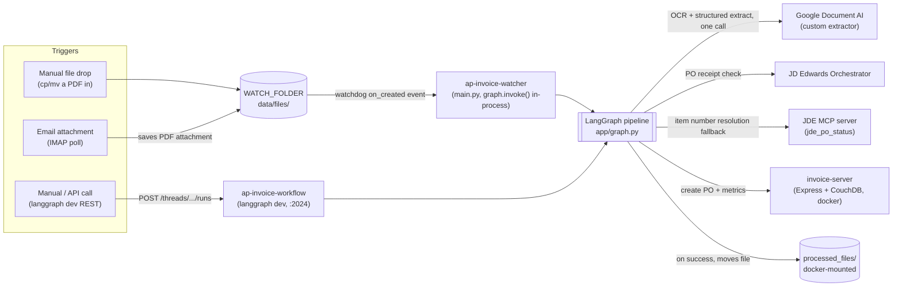
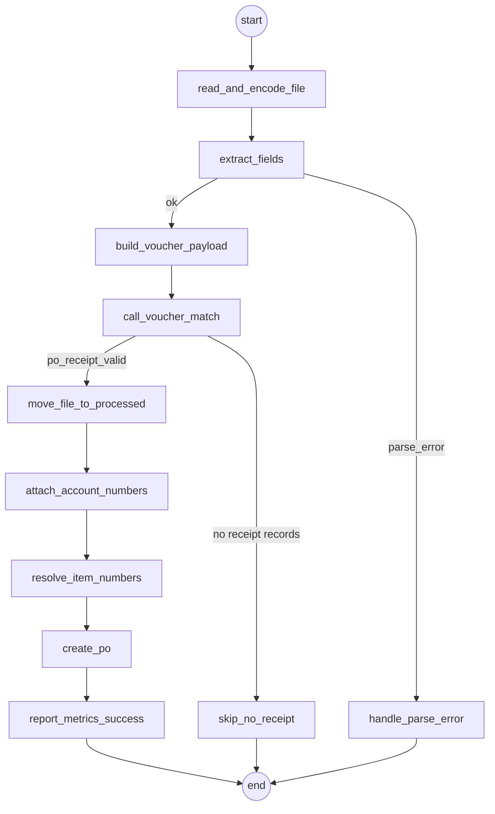

# AP Invoice Workflow

A LangGraph port of an n8n workflow ("FTP based WF") that turns a vendor
invoice PDF into a JD Edwards purchase order automatically: run it through a
Document AI custom extractor (OCR + structured field extraction in one
call), validate it against JDE's PO receipt records, and — if it checks
out — create the PO in the downstream invoice server.

## Contents

- [How it works](#how-it-works)
- [Repository layout](#repository-layout)
- [Prerequisites](#prerequisites)
- [Setup](#setup)
- [Running it](#running-it)
- [Testing it manually](#testing-it-manually)
- [Configuration reference](#configuration-reference)
- [Logging](#logging)
- [Tracing (LangSmith)](#tracing-langsmith)
- [Known gotchas](#known-gotchas)

## How it works

Three independent triggers can start a run, but they all converge on the
same graph — none of them duplicate the processing logic:



- **Folder watcher** (`app/watcher.py`, entry point `main.py`) — watches
  `WATCH_FOLDER` with `watchdog` and calls `graph.invoke()` directly,
  in-process, the moment a file's write settles. This is what makes
  "drop a PDF and it just happens" work.
- **Email trigger** (`app/email_watcher.py`, entry point `email_main.py`) —
  polls an IMAP mailbox for unseen messages, saves any PDF attachment into
  `WATCH_FOLDER`, and marks the message `\Seen`. It does **not** invoke the
  graph itself — it hands off to the folder watcher above, so there's only
  one place graph invocation happens.
- **`langgraph dev` API** (`langgraph.json` → `app.graph:build_graph`) — a
  REST server on port 2024 for manually invoking the graph against a
  specific file (what you'd use for testing, or LangGraph Studio's UI). It
  does not watch anything on its own.

### The graph itself

`app/graph.py` builds an 11-node LangGraph state machine. It used to be 14
nodes with two branches joining before a separate Gemini extraction call —
that's gone now that Document AI's custom extractor does OCR and field
extraction in a single call. Two points in the graph still route
conditionally based on the data seen so far:



| Node | Does |
|---|---|
| `read_and_encode_file` | Reads the PDF, base64-encodes it |
| `extract_fields` | Sends it to Document AI's custom extractor (OCR + schema field extraction in one call) and converts the returned entities into the canonical field shape (`app/document_ai.py::parse_entities`) |
| `build_voucher_payload` | Shapes extracted fields into the JDE orchestrator's request format |
| `call_voucher_match` | Calls JDE's PO receipt inquiry orchestrator |
| `move_file_to_processed` | Moves the source PDF into the processed-files folder |
| `attach_account_numbers` | Adds GL account numbers to freight/handling fee lines |
| `resolve_item_numbers` | For lines JDE's voucher-match couldn't resolve, tries to find the right JDE item number (see below) and attaches any confident finding as an `item_suggestions` entry for dashboard review — never blocks `create_po`, even on its own bugs |
| `create_po` | POSTs the final PO to `invoice-server` |
| `report_metrics_success` | Reports execution metrics to `invoice-server` |
| `skip_no_receipt` / `handle_parse_error` | Terminal no-op branches, just set `status` |

`parse_error` stays in the state contract (`route_after_parse` still checks
it) but a soft parse failure can't really happen the way free-text LLM JSON
parsing used to fail — Document AI's entities are already structured. A bad
call to it just raises and goes through the normal exception path instead.

#### How `resolve_item_numbers` finds an item number

JDE's voucher-match sometimes can't resolve a line's item ("Unable to fetch
Order/Item information") — e.g. an ACDelco backorder invoice can ship a
*different, substituted* part than what was originally ordered, and JDE's
PO line references the original one. Resolution is tried in this order,
each falling through to the next on a miss:

1. **`item_crossref` cache** (`invoice_server.lookup_item_crossref`) — a
   previously human-confirmed `(supplier, item_number) -> assigned item`
   mapping. Applied immediately, no review needed.
2. **Identifier suffix match** (`jde_mcp_client.find_po_line_by_item_number`)
   — the PDF's own item number, normalized (uppercase, `-`/`/`/space
   stripped), compared as a *suffix* of every PO line's `SecondItemNumber`
   (JDE's catalog codes are consistently formatted as a brand/prefix plus
   the raw manufacturer part number, e.g. `"35PS"` → `"D0735PS"`). A bare
   suffix hit isn't trusted alone — it's only confident if that line's
   quantity (tight tolerance) or unit cost (15% tolerance, to survive a
   discount/rebate program) also corroborates it.
3. **Quantity + unit price fuzzy match** (`jde_mcp_client.find_matching_po_line`)
   — only reached if there's no identifier to try or the suffix match came
   up empty/ambiguous. Matches a PO line by `OrderedQuantity` and a derived
   `ExtendedCost / OrderedQuantity` unit price, both within a $0.01
   tolerance. Weaker signal than identifier matching — it can (and has)
   landed on the wrong PO line when a substituted part coincidentally
   shares quantity/price with an unrelated line on the same PO.

A genuine substitution across unrelated manufacturer part numbers (e.g. GM's
OEM number vs. ACDelco's catalog SKU for the same physical part) isn't
solvable by either of these — it needs a real cross-reference, which is
exactly what step 1's cache is for once a human confirms it once.

## Repository layout

```
ap-invoice-workflow/
├── app/
│   ├── graph.py            # the LangGraph pipeline + per-node logging
│   ├── watcher.py           # folder-watch trigger (used by main.py)
│   ├── email_watcher.py      # IMAP trigger (used by email_main.py)
│   ├── document_ai.py        # Document AI custom extractor: OCR + field extraction in one call
│   ├── jde_client.py           # JDE voucher-match payload + call
│   ├── jde_mcp_client.py         # JDE MCP client: PO-lines fetch + item number matching fallback
│   ├── invoice_server.py          # create-po / workflow-metrics / item_crossref cache calls
│   ├── schema_builder.py           # GL account-number lookup from config/schema_fields.json
│   ├── google_auth.py               # shared ADC token helper
│   ├── state.py                      # the InvoiceState TypedDict threaded through the graph
│   ├── settings.py                    # all config, loaded from .env
│   └── guardrails.py                   # PII redaction - not wired into graph.py, kept for reference
├── config/schema_fields.json          # GL account numbers per field (schema_builder.account_number_for)
├── main.py                             # entry point: folder watcher
├── email_main.py                        # entry point: email trigger
├── langgraph.json                        # langgraph dev / Studio config
├── requirements.txt
└── .env / .env.example
```

## Prerequisites

- Python 3.12+ and the project's venv (`.venv/`, already set up if you're
  reading this in place — otherwise `python3 -m venv .venv`)
- **Google Cloud** access to the Document AI custom extractor processor
  referenced in `.env` — authenticated via Application Default Credentials:
  ```bash
  gcloud auth application-default login
  ```
  (or set `GOOGLE_APPLICATION_CREDENTIALS` to a service account key file)
- **JD Edwards** orchestrator reachable from this machine, with valid
  `JDE_USERNAME` / `JDE_PASSWORD`
- **JDE MCP server** reachable at `JDE_MCP_BASE_URL` (its `jde_po_status`
  tool backs `resolve_item_numbers`'s fallback item-matching) — same
  `JDE_USERNAME` / `JDE_PASSWORD` are reused to log in via its manual
  `/auth/login` route
- **`invoice-server` + CouchDB** running — see `../docker-compose.yml` in
  the parent `invoice-processing/` directory (`docker-compose up -d server
  couchdb`). `create_po` and `report_metrics_success` call this service.
- (Optional) **IMAP credentials** for the email trigger — most providers
  need an app password, not your normal login password

## Setup

1. Install dependencies:
   ```bash
   cd ap-invoice-workflow
   python3 -m venv .venv          # if not already present
   .venv/bin/pip install -r requirements.txt
   ```
2. Copy the env template and fill in real values:
   ```bash
   cp .env.example .env
   ```
3. Authenticate to Google Cloud (see Prerequisites above).
4. Make sure `docker-compose`'s `server` and `couchdb` containers are up
   (from the parent `invoice-processing/` directory):
   ```bash
   cd .. && docker-compose up -d server couchdb
   ```
5. **Check `WATCH_FOLDER` / `PROCESSED_SUBFOLDER` line up with the docker
   volume mount** — see [Known gotchas](#known-gotchas) below before your
   first real run. This one bites if skipped.

## Running it

Three independent processes, one per trigger described above. In
production these run as systemd services (see below); for local dev you
can just run them directly.

### 1. Folder watcher (auto-trigger on file drop)

```bash
.venv/bin/python3 main.py
```
Watches `WATCH_FOLDER`; drop a PDF in and it's processed automatically.

### 2. Email trigger (auto-trigger on new email)

```bash
.venv/bin/python3 email_main.py
```
Requires `IMAP_HOST` / `IMAP_USERNAME` / `IMAP_PASSWORD` set in `.env`, or
it exits immediately with a clear error.

### 3. `langgraph dev` API (manual / Studio testing)

```bash
.venv/bin/langgraph dev --no-browser --port 2024
```
Exposes the graph over HTTP — see [Testing it manually](#testing-it-manually).

### As systemd services

If this machine has the services installed (`ap-invoice-workflow`,
`ap-invoice-watcher`, `ap-invoice-email-watcher`):

```bash
sudo systemctl start|stop|restart|status ap-invoice-workflow      # langgraph dev API
sudo systemctl start|stop|restart|status ap-invoice-watcher       # folder watcher
sudo systemctl start|stop|restart|status ap-invoice-email-watcher # email trigger

journalctl -u ap-invoice-watcher -f     # live logs, any of the three units
```

All three are `enable`d, so they come back on reboot. **They only read
`.env` at process startup** — after any `.env` change, restart the
relevant service(s) for it to take effect. Code changes under `app/` are
different: `langgraph dev` hot-reloads them automatically (watch for `1
change detected` in its log); the watcher/email processes need a restart
like any plain Python script.

## Testing it manually

With `langgraph dev` running, invoke the graph against any PDF without
needing the folder watcher at all:

```bash
FILE_PATH="/absolute/path/to/invoice.pdf"
THREAD_ID=$(curl -s -X POST http://127.0.0.1:2024/threads -d '{}' \
  -H "Content-Type: application/json" | python3 -c "import sys,json;print(json.load(sys.stdin)['thread_id'])")

curl -s -X POST "http://127.0.0.1:2024/threads/$THREAD_ID/runs/wait" \
  -H "Content-Type: application/json" \
  -d "{\"assistant_id\":\"ap_invoice_workflow\",\"input\":{\"file_path\":\"$FILE_PATH\",\"file_name\":\"$(basename "$FILE_PATH")\",\"execution_start_ms\":$(python3 -c 'import time;print(time.time()*1000)')}}" \
  | python3 -m json.tool
```

The response is the full final state — check `status` (`success` /
`skipped_no_receipt` / `parse_error`), `extracted`, `voucher_match_response`,
and `create_po_response`.

Or just drop a file into `WATCH_FOLDER` with the folder watcher running —
same graph, same result, no API call needed.

## Configuration reference

All settings live in `.env` (see `app/settings.py`). Required vars raise a
clear `RuntimeError` on startup (via `validate()` / `validate_imap()`) if
missing.

| Variable | Default | Purpose |
|---|---|---|
| `JDE_USERNAME` / `JDE_PASSWORD` | *(required)* | JDE orchestrator login |
| `WATCH_FOLDER` | `/home/node/.n8n-files` | Folder the watcher observes and the email trigger drops attachments into |
| `PROCESSED_SUBFOLDER` | `processed_files` | Where processed files are moved to — **must resolve to a path the `invoice-server` container can also see**; an absolute path here overrides `WATCH_FOLDER` entirely (see gotchas) |
| `GCP_PROJECT_ID`, `DOCAI_LOCATION`, `DOCAI_PROCESSOR_ID` | `DOCAI_PROCESSOR_ID` defaults to `cf3e6a8379c1e4c5` | Document AI **custom extractor** processor - does OCR and schema field extraction in one call (`app/document_ai.py::process_document` + `parse_entities`) |
| `VERTEX_PROJECT_ID`, `VERTEX_LOCATION`, `GEMINI_MODEL` | — | **Dead** - was only read by the old Gemini extraction step (`gemini_extract.py`, removed) before the Document AI custom extractor replaced it; safe to drop from `.env` |
| `PII_ENTITIES` | `CREDIT_CARD,EMAIL_ADDRESS` | **Unused by the graph** for the same reason - `guardrails.py` isn't wired into `graph.py` anymore. If you do call it directly: its credit-card regex is Luhn-gated, so plain long numeric identifiers (POs, order numbers) no longer false-positive as card numbers the way it originally did |
| `JDE_ORCHESTRATOR_URL` | — | JDE PO receipt inquiry orchestrator endpoint |
| `JDE_MOCK_MODE` | `false` | Bypass the live JDE call with a canned response — **never leave true against a real deployment**, it skips the receipt-validity check entirely |
| `JDE_MOCK_RECORDS` | `1` | Canned record count returned when mock mode is on |
| `JDE_MCP_BASE_URL` | `http://127.0.0.1:8006` | JDE MCP server backing `resolve_item_numbers`'s PO-lines fallback lookup (see "How it works") |
| `INVOICE_SERVER_BASE_URL` | — | Base URL of the `invoice-server` service |
| `SCHEMA_FIELDS_CONFIG` | `config/schema_fields.json` | GL account-number lookup for `attach_account_numbers` (`schema_builder.account_number_for`) - its field/array-field schema-building use is dead now that Gemini isn't called |
| `IMAP_HOST` / `IMAP_USERNAME` / `IMAP_PASSWORD` | *(blank = trigger disabled)* | Email trigger mailbox login |
| `IMAP_PORT` | `993` | IMAP port |
| `IMAP_USE_SSL` | `true` | Use `IMAP4_SSL` vs plain `IMAP4` |
| `IMAP_FOLDER` | `INBOX` | Mailbox folder polled for unseen messages |
| `IMAP_POLL_SECONDS` | `60` | Poll interval |
| `LANGCHAIN_TRACING_V2` | *(unset = disabled)* | Set to `true` to send every `graph.invoke()` call to LangSmith - see [Tracing](#tracing-langsmith) |
| `LANGCHAIN_API_KEY` | — | LangSmith API key |
| `LANGCHAIN_PROJECT` | `default` | LangSmith project name traces are grouped under |
| `LANGSMITH_ENDPOINT` | `https://api.smith.langchain.com` (US) | **Required if your LangSmith account isn't on the US region** - e.g. `https://apac.api.smith.langchain.com` for APAC. Wrong/missing region gives a flat `403 Forbidden` on every request that looks identical to an invalid key |
| `LANGSMITH_WORKSPACE_ID` | — | Needed if the account has multiple workspaces |

## Logging

Every node logs a clean, self-contained block — designed to survive
systemd's journal capture (which splits on literal newlines, so nothing
here embeds them):

```
>> START extract_fields
document_ai.process_document: POST https://... encoded_len=325416
document_ai.process_document: received 1256 chars of OCR text, 13 entities
document_ai.parse_entities: parsed OK | fields=[...] products=1
OK DONE  extract_fields                (3.62s)
    extracted: {"invoice_number": "17835694", "purchase_order": "353236", ...}
----------------------------------------------------------------------
```

- `>> START <node>` / `OK DONE <node> (Xs)` / `!! FAILED <node> (Xs)` — one
  line per node, easy to `grep`
- `>> ROUTE <fn>: <condition> => <next node>` — logs which way each
  conditional edge went and why
- One `key: value` line per output field, not a single giant blob
- `password` is redacted to `<redacted>` wherever it appears; `base64_content`
  is truncated with a `<N chars>` size prefix (~300KB per invoice)

```bash
journalctl -u ap-invoice-watcher -f       # or ap-invoice-workflow / ap-invoice-email-watcher
```

## Tracing (LangSmith)

Setting `LANGCHAIN_TRACING_V2=true` + `LANGCHAIN_API_KEY` in `.env` traces
every `graph.invoke()` call to LangSmith automatically — no code changes,
and it covers all three processes (folder watcher, email watcher, and
`langgraph dev` alike), not just runs made through the dev API. Each trace
is the full DAG for one invoice with every node's exact input/output and
timing, viewable in the LangSmith web UI.

**Check your region before assuming a bad key.** LangSmith has isolated
regional deployments (US, EU, APAC, ...) with separate auth — an
otherwise-valid key issued outside the US region will 403 on every request
against the default `https://api.smith.langchain.com` endpoint, with no
detail beyond `{"detail":"Forbidden"}`. If that happens, set
`LANGSMITH_ENDPOINT` to your region's API host (e.g.
`https://apac.api.smith.langchain.com`) and match the web UI host too
(`https://apac.smith.langchain.com`, not the bare `smith.langchain.com`) —
they're separate deployments with separate data, so the right region's UI
is the only place a trace will actually show up.

To sanity-check a key/endpoint combination outside the app, install the
[`langsmith-skills`](https://github.com/langchain-ai/langsmith-skills) repo's
`langsmith-trace` skill (or just its CLI) and run:
```bash
langsmith project list --api-key $LANGCHAIN_API_KEY --api-url https://apac.api.smith.langchain.com
```
An empty table (not a 403) means the key and region are both correct.

## Known gotchas

- **`PROCESSED_SUBFOLDER` must match a path the `invoice-server` docker
  container can actually see.** That container mounts
  `./data/processed_files` (relative to `invoice-processing/docker-compose.yml`)
  as `/home/node/.n8n-files`. If `PROCESSED_SUBFOLDER` resolves anywhere
  else, `create_po` will 500 with an `ENOENT` from inside the container —
  the file exists on your host, just not where the container can read it.
  Since `os.path.join` discards `WATCH_FOLDER` when `PROCESSED_SUBFOLDER`
  is itself absolute, set it to the full docker-mounted path directly:
  `PROCESSED_SUBFOLDER=/home/ubuntu/invoice-processing/data/processed_files`.
- **`invoice-server`'s `create-po` handler expects a legacy, short
  `file_path`** (`/processed_files/<name>`), a leftover from the original
  n8n workflow's string-replace logic. `invoice_server.py` already sends
  this format regardless of the real absolute path — don't "simplify" it
  to send the real path, that will break the request again.
- **Systemd services cache `.env` at startup.** Editing `.env` alone does
  nothing until you restart the affected service.
- **Email trigger dedup uses IMAP's `\Seen` flag.** If a human reads an
  invoice email in a normal mail client before the poller runs, it becomes
  "seen" and is silently skipped. Keep the polled mailbox dedicated to
  automation, or be aware of the collision.
- **Never log a raw multi-line string directly.** systemd's journal
  capture is line-oriented — a single log call containing an embedded `\n`
  gets shredded into multiple journal entries that lose their logger
  prefix on every line after the first. `graph.py`'s `_for_log()` flattens
  newlines out of every string for this reason; keep that pattern if you
  add new logging elsewhere.
- **`guardrails.py` is still on disk but not imported by `graph.py`.** It
  was part of the old OCR-text → PII-redact → Gemini-extract path, replaced
  by Document AI's custom extractor doing OCR + extraction in one call
  (`gemini_extract.py`, the other half of that old path, has been removed).
  Left in place in case it's wanted again; don't be surprised it's dead
  code, and don't assume `PII_ENTITIES` does anything in the current graph.
- **A backorder invoice can ship a different part than what was ordered.**
  JDE's PO only carries a line for the originally-ordered part, so a
  substituted item's real JDE code sometimes isn't derivable from the PO at
  all — it needs a confirmed mapping in the `item_crossref` cache (see "How
  `resolve_item_numbers` finds an item number" above). Don't assume
  `item_suggestions` being empty means something's broken; it may just mean
  no automatic strategy could safely find that item.
- **LangSmith regions are isolated deployments with separate auth.** A key
  that looks well-formed (`langsmith auth info` reports `Authenticated:
  true`) but 403s on every single API call, with no detail beyond
  `{"detail":"Forbidden"}`, almost always means the key's region doesn't
  match the endpoint you're calling — see [Tracing](#tracing-langsmith).
