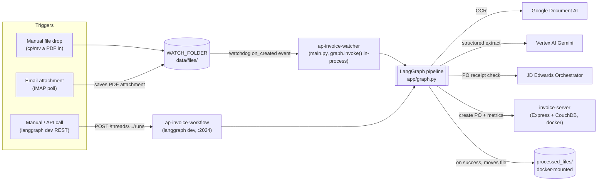
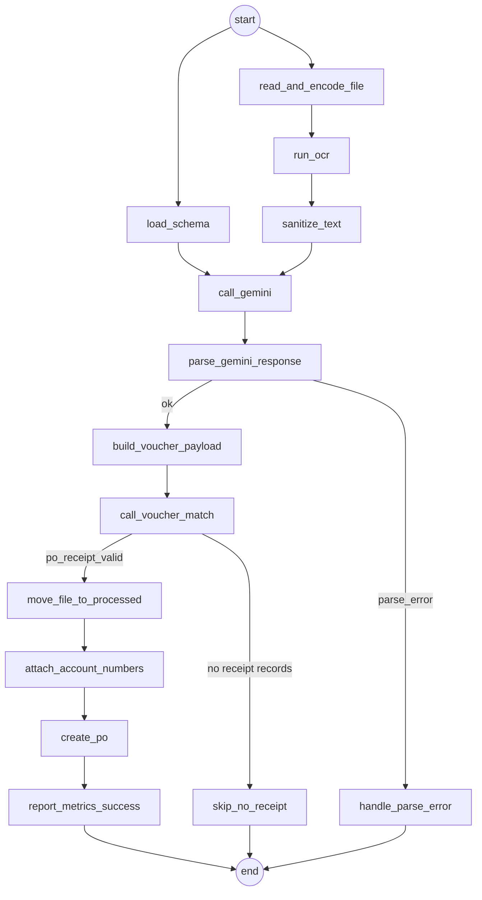

# AP Invoice Workflow

A LangGraph port of an n8n workflow ("FTP based WF") that turns a vendor
invoice PDF into a JD Edwards purchase order automatically: OCR it, extract
structured fields with Gemini, validate it against JDE's PO receipt records,
and — if it checks out — create the PO in the downstream invoice server.

## Contents

- [How it works](#how-it-works)
- [Repository layout](#repository-layout)
- [Prerequisites](#prerequisites)
- [Setup](#setup)
- [Running it](#running-it)
- [Testing it manually](#testing-it-manually)
- [Configuration reference](#configuration-reference)
- [Logging](#logging)
- [Known gotchas](#known-gotchas)

## How it works

Three independent triggers can start a run, but they all converge on the
same graph — none of them duplicate the processing logic:



- **Folder watcher** (`app/watcher.py`, entry point `main.py`) — watches
  `WATCH_FOLDER` with `watchdog` and calls `graph.invoke()` directly,
  in-process, the moment a file's write settles. This is what makes
  "drop a PDF and it just happens" work.
- **Email trigger** (`app/email_watcher.py`, entry point `email_main.py`) —
  polls an IMAP mailbox for unseen messages, saves any PDF attachment into
  `WATCH_FOLDER`, and marks the message `\Seen`. It does **not** invoke the
  graph itself — it hands off to the folder watcher above, so there's only
  one place graph invocation happens.
- **`langgraph dev` API** (`langgraph.json` → `app.graph:build_graph`) — a
  REST server on port 2024 for manually invoking the graph against a
  specific file (what you'd use for testing, or LangGraph Studio's UI). It
  does not watch anything on its own.

### The graph itself

`app/graph.py` builds a 14-node LangGraph state machine. Two branches run
in parallel and join before calling Gemini; two points in the graph route
conditionally based on the data seen so far:



| Node | Does |
|---|---|
| `load_schema` | Builds the Gemini response schema from `config/schema_fields.json` |
| `read_and_encode_file` | Reads the PDF, base64-encodes it |
| `run_ocr` | Sends it to Google Document AI, gets back raw text |
| `sanitize_text` | Regex-redacts PII (credit cards, emails) before it goes to an LLM |
| `call_gemini` | Schema-constrained extraction via Vertex AI Gemini |
| `parse_gemini_response` | Parses the JSON Gemini returned |
| `build_voucher_payload` | Shapes extracted fields into the JDE orchestrator's request format |
| `call_voucher_match` | Calls JDE's PO receipt inquiry orchestrator |
| `move_file_to_processed` | Moves the source PDF into the processed-files folder |
| `attach_account_numbers` | Adds GL account numbers to freight/handling fee lines |
| `create_po` | POSTs the final PO to `invoice-server` |
| `report_metrics_success` | Reports execution metrics to `invoice-server` |
| `skip_no_receipt` / `handle_parse_error` | Terminal no-op branches, just set `status` |

## Repository layout

```
ap-invoice-workflow/
├── app/
│   ├── graph.py            # the LangGraph pipeline + per-node logging
│   ├── watcher.py           # folder-watch trigger (used by main.py)
│   ├── email_watcher.py      # IMAP trigger (used by email_main.py)
│   ├── document_ai.py        # Google Document AI OCR
│   ├── gemini_extract.py      # Vertex AI Gemini structured extraction
│   ├── guardrails.py          # PII redaction before the Gemini call
│   ├── jde_client.py           # JDE voucher-match payload + call
│   ├── invoice_server.py        # create-po / workflow-metrics calls
│   ├── schema_builder.py         # builds the schema from config/schema_fields.json
│   ├── google_auth.py             # shared ADC token helper
│   ├── state.py                    # the InvoiceState TypedDict threaded through the graph
│   └── settings.py                  # all config, loaded from .env
├── config/schema_fields.json          # which invoice fields to extract, and their GL account numbers
├── main.py                             # entry point: folder watcher
├── email_main.py                        # entry point: email trigger
├── langgraph.json                        # langgraph dev / Studio config
├── requirements.txt
└── .env / .env.example
```

## Prerequisites

- Python 3.12+ and the project's venv (`.venv/`, already set up if you're
  reading this in place — otherwise `python3 -m venv .venv`)
- **Google Cloud** access to the Document AI processor and Vertex AI Gemini
  model referenced in `.env` — authenticated via Application Default
  Credentials:
  ```bash
  gcloud auth application-default login
  ```
  (or set `GOOGLE_APPLICATION_CREDENTIALS` to a service account key file)
- **JD Edwards** orchestrator reachable from this machine, with valid
  `JDE_USERNAME` / `JDE_PASSWORD`
- **`invoice-server` + CouchDB** running — see `../docker-compose.yml` in
  the parent `invoice-processing/` directory (`docker-compose up -d server
  couchdb`). `create_po` and `report_metrics_success` call this service.
- (Optional) **IMAP credentials** for the email trigger — most providers
  need an app password, not your normal login password

## Setup

1. Install dependencies:
   ```bash
   cd ap-invoice-workflow
   python3 -m venv .venv          # if not already present
   .venv/bin/pip install -r requirements.txt
   ```
2. Copy the env template and fill in real values:
   ```bash
   cp .env.example .env
   ```
3. Authenticate to Google Cloud (see Prerequisites above).
4. Make sure `docker-compose`'s `server` and `couchdb` containers are up
   (from the parent `invoice-processing/` directory):
   ```bash
   cd .. && docker-compose up -d server couchdb
   ```
5. **Check `WATCH_FOLDER` / `PROCESSED_SUBFOLDER` line up with the docker
   volume mount** — see [Known gotchas](#known-gotchas) below before your
   first real run. This one bites if skipped.

## Running it

Three independent processes, one per trigger described above. In
production these run as systemd services (see below); for local dev you
can just run them directly.

### 1. Folder watcher (auto-trigger on file drop)

```bash
.venv/bin/python3 main.py
```
Watches `WATCH_FOLDER`; drop a PDF in and it's processed automatically.

### 2. Email trigger (auto-trigger on new email)

```bash
.venv/bin/python3 email_main.py
```
Requires `IMAP_HOST` / `IMAP_USERNAME` / `IMAP_PASSWORD` set in `.env`, or
it exits immediately with a clear error.

### 3. `langgraph dev` API (manual / Studio testing)

```bash
.venv/bin/langgraph dev --no-browser --port 2024
```
Exposes the graph over HTTP — see [Testing it manually](#testing-it-manually).

### As systemd services

If this machine has the services installed (`ap-invoice-workflow`,
`ap-invoice-watcher`, `ap-invoice-email-watcher`):

```bash
sudo systemctl start|stop|restart|status ap-invoice-workflow      # langgraph dev API
sudo systemctl start|stop|restart|status ap-invoice-watcher       # folder watcher
sudo systemctl start|stop|restart|status ap-invoice-email-watcher # email trigger

journalctl -u ap-invoice-watcher -f     # live logs, any of the three units
```

All three are `enable`d, so they come back on reboot. **They only read
`.env` at process startup** — after any `.env` change, restart the
relevant service(s) for it to take effect. Code changes under `app/` are
different: `langgraph dev` hot-reloads them automatically (watch for `1
change detected` in its log); the watcher/email processes need a restart
like any plain Python script.

## Testing it manually

With `langgraph dev` running, invoke the graph against any PDF without
needing the folder watcher at all:

```bash
FILE_PATH="/absolute/path/to/invoice.pdf"
THREAD_ID=$(curl -s -X POST http://127.0.0.1:2024/threads -d '{}' \
  -H "Content-Type: application/json" | python3 -c "import sys,json;print(json.load(sys.stdin)['thread_id'])")

curl -s -X POST "http://127.0.0.1:2024/threads/$THREAD_ID/runs/wait" \
  -H "Content-Type: application/json" \
  -d "{\"assistant_id\":\"ap_invoice_workflow\",\"input\":{\"file_path\":\"$FILE_PATH\",\"file_name\":\"$(basename "$FILE_PATH")\",\"execution_start_ms\":$(python3 -c 'import time;print(time.time()*1000)')}}" \
  | python3 -m json.tool
```

The response is the full final state — check `status` (`success` /
`skipped_no_receipt` / `parse_error`), `extracted`, `voucher_match_response`,
and `create_po_response`.

Or just drop a file into `WATCH_FOLDER` with the folder watcher running —
same graph, same result, no API call needed.

## Configuration reference

All settings live in `.env` (see `app/settings.py`). Required vars raise a
clear `RuntimeError` on startup (via `validate()` / `validate_imap()`) if
missing.

| Variable | Default | Purpose |
|---|---|---|
| `JDE_USERNAME` / `JDE_PASSWORD` | *(required)* | JDE orchestrator login |
| `WATCH_FOLDER` | `/home/node/.n8n-files` | Folder the watcher observes and the email trigger drops attachments into |
| `PROCESSED_SUBFOLDER` | `processed_files` | Where processed files are moved to — **must resolve to a path the `invoice-server` container can also see**; an absolute path here overrides `WATCH_FOLDER` entirely (see gotchas) |
| `GCP_PROJECT_ID`, `DOCAI_LOCATION`, `DOCAI_PROCESSOR_ID` | — | Google Document AI processor to OCR with |
| `VERTEX_PROJECT_ID`, `VERTEX_LOCATION`, `GEMINI_MODEL` | — | Vertex AI Gemini model for extraction |
| `PII_ENTITIES` | `CREDIT_CARD,EMAIL_ADDRESS` | Which entity types `guardrails.py` redacts before the Gemini call |
| `JDE_ORCHESTRATOR_URL` | — | JDE PO receipt inquiry orchestrator endpoint |
| `JDE_MOCK_MODE` | `false` | Bypass the live JDE call with a canned response — **never leave true against a real deployment**, it skips the receipt-validity check entirely |
| `JDE_MOCK_RECORDS` | `1` | Canned record count returned when mock mode is on |
| `INVOICE_SERVER_BASE_URL` | — | Base URL of the `invoice-server` service |
| `SCHEMA_FIELDS_CONFIG` | `config/schema_fields.json` | Field/account-number config for extraction |
| `IMAP_HOST` / `IMAP_USERNAME` / `IMAP_PASSWORD` | *(blank = trigger disabled)* | Email trigger mailbox login |
| `IMAP_PORT` | `993` | IMAP port |
| `IMAP_USE_SSL` | `true` | Use `IMAP4_SSL` vs plain `IMAP4` |
| `IMAP_FOLDER` | `INBOX` | Mailbox folder polled for unseen messages |
| `IMAP_POLL_SECONDS` | `60` | Poll interval |

## Logging

Every node logs a clean, self-contained block — designed to survive
systemd's journal capture (which splits on literal newlines, so nothing
here embeds them):

```
>> START run_ocr
document_ai.run_ocr: POST https://... encoded_len=325416
document_ai.run_ocr: received 1256 chars of OCR text
OK DONE  run_ocr                      (3.62s)
    ocr_text: <2563 chars> Gates REMIT TO: GATES CORPORATION...
----------------------------------------------------------------------
```

- `>> START <node>` / `OK DONE <node> (Xs)` / `!! FAILED <node> (Xs)` — one
  line per node, easy to `grep`
- `>> ROUTE <fn>: <condition> => <next node>` — logs which way each
  conditional edge went and why
- One `key: value` line per output field, not a single giant blob
- `password` is redacted to `<redacted>` wherever it appears; `base64_content`
  / `ocr_text` / `sanitized_text` are truncated with a `<N chars>` size
  prefix (the base64 blob alone is ~300KB per invoice)

```bash
journalctl -u ap-invoice-watcher -f       # or ap-invoice-workflow / ap-invoice-email-watcher
```

## Known gotchas

- **`PROCESSED_SUBFOLDER` must match a path the `invoice-server` docker
  container can actually see.** That container mounts
  `./data/processed_files` (relative to `invoice-processing/docker-compose.yml`)
  as `/home/node/.n8n-files`. If `PROCESSED_SUBFOLDER` resolves anywhere
  else, `create_po` will 500 with an `ENOENT` from inside the container —
  the file exists on your host, just not where the container can read it.
  Since `os.path.join` discards `WATCH_FOLDER` when `PROCESSED_SUBFOLDER`
  is itself absolute, set it to the full docker-mounted path directly:
  `PROCESSED_SUBFOLDER=/home/ubuntu/invoice-processing/data/processed_files`.
- **`invoice-server`'s `create-po` handler expects a legacy, short
  `file_path`** (`/processed_files/<name>`), a leftover from the original
  n8n workflow's string-replace logic. `invoice_server.py` already sends
  this format regardless of the real absolute path — don't "simplify" it
  to send the real path, that will break the request again.
- **Systemd services cache `.env` at startup.** Editing `.env` alone does
  nothing until you restart the affected service.
- **Email trigger dedup uses IMAP's `\Seen` flag.** If a human reads an
  invoice email in a normal mail client before the poller runs, it becomes
  "seen" and is silently skipped. Keep the polled mailbox dedicated to
  automation, or be aware of the collision.
- **Never log a raw multi-line string directly.** systemd's journal
  capture is line-oriented — a single log call containing an embedded `\n`
  gets shredded into multiple journal entries that lose their logger
  prefix on every line after the first. `graph.py`'s `_for_log()` flattens
  newlines out of every string for this reason; keep that pattern if you
  add new logging elsewhere.
